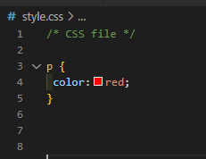

# CSS Notes

documenting / taking notes every topic of the tutorial <br>
[CSS_ZeroToHero](https://youtu.be/1Rs2ND1ryYc) <br>

# CSS: An Introduction

## What is CSS?

- CSS stands for Cascading Style Sheet.
- It is a language used to give styling and design to websites
- It is the standard for styling websites, used by most/all website across the globe
- It usually goes hand-in-hand with HTML, while CSS3 (lates version) brings lots of new feature to table

## Why use CSS?

There are many reasons to use CSS,such as:

- Styling
- Layout & Design
- Animations
- Font Changes
- Organization
- Grid Systems


## How is CSS Used?

- typically, a file is saved in the <code>.css</code> format, and linked to using an HTML tag.
- CSS selectors can be used to address parts of the page style and use.
- HTML Elements are given Class and ID attributes, which are then used to manipulate in CSS.
- It typically follows this method:Select, then Edit.

## Creating & Linking a CSS stylesheet


# CSS syntax


- <b>Selector</b> - points to the HTML element you want to style
- <b>Declaration block</b> - contains one or more declarations separated by semicolons <code>";"</code>.
- each declaration includes a CSS <b>property</b> name and a <b>value</b>, separated by a colon<code>":"</code>.
- Multiple CSS declarations are separated wih semicolons, and declaration blocks are sorrounded by curly braces.

## CSS Selectors

- Selectors are used to find or select the HTML elements you want to style
- Selectors are ways of grabbing and manipulating HTML
- There are many different ways to select, however they all turn out the same way.
- Different selectors have different applications.

## Five Categories of Selectors

- <b>Simple selectors</b> - Select elements based on name, id,class
- <b>Combinator Selectors</b> - Select elements based on a specific relationship between them
- <b>Psedo-class selectors</b> - select elements based on a certain state.
- <b>Pseudo-elements selectors </b> - select and style a part of an element
- <b>Attribute selectors</b> - select elements based on an attribute or attribute value

<hr>

## Selectors: The Element Selector

HTML
CSS
WEB Output<br>

- you can select entire elements without any special characters.
- This applies to all of the elements with that tag on the page.
- it ranks on the bottom of the specificity scale.

<hr>

## Selectors: The Class Selector

HTML
CSS
WEB Output<br>

- this is used to select elements with a certain class name.
- can be used on any and all elements with that class.
- can be used multiple times, and is select with the <code>.</code>symbol

You can also specify that only specific HTML elements should be affected by a class.

```
p.center {
  text-align: center;
  color: red;
}
```

HTML elements can also refer to more than one class

```
<p class="center large">This paragraph refers to two classes.</p>
```

<hr>

## Selectors: The ID Selectors

HTML
CSS
WEB Output<br>

- this is used to select elements with a certain ID name.
- Can be used on any and all elements with that ID
- unlike classes,it can only be used on one element at a time,and is selected with <code>#</code> symbol.However, It is possible to use more than once,
- an ID name <code>cannot start with a number!</code>

<hr>

## Selectors: Universal Selector

- The universal selector <code>\*</code> selects all HTML elements on the page

```
* {
  text-align: center;
  color: blue;
}
```

<hr>

## Selectors: Grouping Selector

- The grouping selector selects all the HTML elements with the same style definitions.
- It will be better to group the selectors, to minimize the code.

```
h1, h2, p {
  text-align: center;
  color: red;
}
```

<hr>

## Selectors: Three ways to insert CSS

- External CSS
- Internal CSS
- Inline CSS

<b>External CSS</b>

```
<link rel="stylesheet" href="mystyle.css">
```

<b>Internal CSS</b>

```
<link rel="stylesheet" href="mystyle.css">
```

<b>Internal CSS</b>

```
<head>
<style>
body {
  background-color: linen;
}

h1 {
  color: maroon;
  margin-left: 40px;
}
</style>
</head>
```

<b>Inline CSS</b>

```
<h1 style="color:blue;text-align:center;">This is a heading</h1>
<p style="color:red;">This is a paragraph.</p>
```

Note:<br>
What style will be used when there is more than one style specified for an HTML element?<br>
All the styles in a page will "cascade" into a new "virtual" style sheet by the following rules, where number one has the highest priority:

- Inline style (inside an HTML element)
- External and Internal style sheets ( in the head section)
- Browser default
  so, an inline style has the highest priority, and will override external and internal styles and browser defaults

## Specificity & When to use Selectors

<code?>Last Rule and Specificity \* Universal Selector </code><br>
sample:

```
p{
  color:red;
}


p{
  color :blue
}

```

-ma oooverwrite yung first declaration.dito na papasuk yung last rule.ang susundin na style or declaration ng selector is yung nasa bottom part or last entry.

<hr>

## What is Specificity?

It there are two or more conflicting CSS rules that point to the same element, the browser follows some rules to determine which one is most specific and therefore wins out.<br>
Think of specificity as a score/rank that determines which style declarations are ultimately applied to an element.<br>
The universal selector<code>(\*)</code> has low specificity, while ID selectors are highly specific!<br>
<code>Specificity is a common reason why you CSS- rules dont apply to some elements, although you think they should</code>

## Specificity hierarchy

Every selector has its place in the specificity hierarchy. There are four categories which define the specificity level of a selector:<br>

- <b>Inline styles </b> - An inline style is attached directly to the element to be styled

```
<h1 style="color: #ffffff;">
```

- <b>IDs </b> - an ID is a unique identifier to the page elements, such as #navbar

- <b>Classes, attributes and pseudo-classes </b> - This category includes .classes, [attributes] and pseudo-classes such as :hover ,:focus etc.

- <b>Elements and pseudo-elements </b> - this category includes element names and pseudo-elements, such as h1, div, :before and :after

## How to Calculate Specificity?

<code>Memorize how to calculate specificity!</code><br>
Start at 0, and 1000 for style attribute, add 100 for each ID, add 10 for each attribute, class or pseudo-class, and 1 for each element name or pseudo-element.<br>
sample:

```
A: h1
B: #content h1
C: <div id="content"><h1 style="color: #ffffff">Heading</h1></div>
```

- the specificity of A is 1 (one element)
- the specificity of B is 101 (one ID reference and one element)
- the specificity of C is 1000(inline styling)<br>

## Specificity Rules

<b>Equal specificity:the latest rule counts</b>- if the same rule is written twice into the external style sheet, then the lower rule in the style sheet is closer to the element to be styled, and therefore wil be applied:

```
h1 {background-color: yellow;}
h1 {background-color: red;}
```

the latter rule is always applied
<b>ID selectors have a higher specificity than attribute selectors</b>

```
div#a {background-color: green;}
#a {background-color: yellow;}
div[id=a] {background-color: blue;}
```

the first rule is more specific than the other two, and will be applied.

<b>Contextual selectors are more specific than a single element selector</b>
the embedded style sheet is closer to the element to be styled.

```
From external CSS file:
#content h1 {background-color: red;}

In HTML file:
<style>
#content h1 {
  background-color: yellow;
}
</style>

```

the latter rule will be applied <br>

<b>a class selector beats any number of element selectors</b>

- a class selector such as .intro beats h1,p,div etc:

```
.intro {background-color: yellow;}
h1 {background-color: red;}
```

<b>The universal selector and inherited values have a specificity of 0</b> - body and similar have a zero specificity. Inherited values also have a specificity of 0.

## Pseudoselectors

<hr>

## Pseudo-Classes

a pseudo-class is used to define a special state of an element.

- style an element when a user mouss over it
- style visisted and unvisited links differently
- style an element when it gets focus

## syntax

```
selector:pseudo-class {
  property: value;
}
```

# Anchor Pseudo-classes

```
/* unvisited link */
a:link {
  color: #FF0000;
}

/* visited link */
a:visited {
  color: #00FF00;
}

/* mouse over link */
a:hover {
  color: #FF00FF;
}

/* selected link */
a:active {
  color: #0000FF;
}
```

<b>Note</b>:<br>
<code>a:hover</code> Must come after <code>a:link</code> and <code>a:visited</code> in the CSS defination in order to be effective!<code>a:active</code> Must come after a <code>a:hover</code> in the CSS definition in order to be effective! Pseudo-class names are not case-sensitive.

## Pseudo-classes and CSS Classes

Pseudo-classes can be combined with CSS classes:
When you hover over the link in the example,it will change color:

```
a.highlight:hover {
  color: #ff0000;
}
```

## Simple Tooltip Hover

hover over a div element to show a <code>\<p></code> element (like a tooltip)

p {
display: none;
background-color: yellow;
padding: 20px;
}

div:hover p {
display: block;
}

## The :first-child Pseudo-class

the <code>:first-child</code> pseudo-class matches a specified element that is the first child of another element.

```
ul li:first-child {
  color: red;
}
```

## The :lang Pseudo-class

The <code>:lang</code> pseudo-class allows you to define special rules for different languages.

Notes:

## Div and Span - used for grouping

- div - used to group multiple elements
- span - used to group inline content

## Inheritance

- children inherit styles from parent, unless have their own styles.

## COLORS

- color, background-color,background
- color names
- rgb,rgba
- hex
- visual studio code color options
- external resources

<b>color properties</b><br>
-control the color of the element
<b>color background</b><br>
-control the background color of the element

```
#first{
  color:white;
  background-color:black;
}
```

<b>color names > 140</b><br>

```
color:red;
color:green;
etc..
/*ctrl + tab(triger vs code suggestion*/
```

<b>RGB (red,green,blue) 0-255 </b><br>

```
color:rgb(255,0,0) /*red*/
```

<b>RGBA A-opacity/transparency 0-1 </b><br>

```
color:rgba(0,255,0,0.5)
```

<b>HSL</b><br>
<b>Hex Value #RRGGBB</b><br>
<b>123456789 A(10) B(11) C(12) D(13) E(14) F(15) </b><br>
<b>10 11 12 13 14 15 </b><br>
<b>#FF0000 - red</b><br>
<b>#00ff00 - green</b><br>

```
color:#ff0000
```

## Units

- absolute,relative
- pixels
- em,rem
- vw ,vh
- font-size, height, width
<hr>

<b>Pixels</b><br>
-Absolute values, one dot on the screen<br>
<b>FONT-SIZE</b><br>
-control size of the font<br>
<b>WIDTH</b><br>
-control width of the element<br>
<b>HEIGHT</b><br>
-control height of an element<br>

```
h1{
  background:rgb(170, 78, 78);
  color:rgba(255,255,255,0.1);
  font-size:100px;
  width: 500px;
  height:500px;
}
```

<b>% - parent</b><br>
-relative unit/value. Depends on the parent<br>
 <br>

```
/* parent element */
.container{
  background:#c54343;
  width:200px;
  height: 200px;
}

/* child element */
.containerTwo{
background:rgb(92, 92, 194);
width: 50%;
height: 50%;
}
```

<code>
/* <br>
em - relative depends on parent<br>
1em = 16px default browser style;<br>
1em = base value <br>
*/
</code>


```
/* parent element */
div {
  font-size: 10px;
}
/* relative element */
.relative {
  font-size: 2em;
}

/* absolute element */
.absolute {
  font-size: 32px;
}
```

<code>
/* <br>
rem - relative depends on root<br>
1em = 16px default browser style;<br>
*/
</code> <br>


```
/* root element */
html{
  font-size: 32px;
}
/* parent element */
div {
  font-size: 10px;
}
/* relative element */
.relative {
  font-size: 2rem;
}
/* absolute element */
.absolute {
  font-size: 32px;
}

```

<code>
/* <br>
vh - height - percent of the screen<br>
vw - width - percent of the screen<br>
*/
</code> <br>


```
.header{
  width: 50vw;
  height:50vh;
  background: red;
}
.banner{
  width: 100vw;
  height:100vh;
  background: blue;
}
```

<code>
/* <br>
calc()<br>
perform math operations + - *<br>
mix and match values<br>
*/
</code> <br>


```
/* reset default margin */
* {
  margin: 0;
}

.navbar {
  background: blue;
  height: 100px;
  color: white;
  font-size: 3rem;
}

.banner {
  background: red;
  min-height: calc(100vh - 100px);
}
```

## TYPOGRAPHY

- properties
- font-stack, generic family
- google fonts

<code>
/* <br>
font-size font-family<br>
*/
</code> <br>


```
body {
font-family: helvetica;
}
h1 {
font-family: verdana;
}

```

<code>
/* <br>
font-stack generic-family<br>
serif, sans-serif, cursive, fantasy, monospace<br>
*/
</code> <br>
A font stack is a list of fonts in the CSS font-family declaration. ... A font stack allows you to control the look of the fonts on the web page even if the site visitor's computer doesn't have the initial font that you called for
 

```
body {
  font-family: helvetica;
}
h1 {
  font-family: 'Courier New', Courier, monospace
}
```

<code>
/* <br>
Google Fonts<br>
*/
</code> <br>

[fonts.google.com](https://fonts.google.com/)


```
@import url('https://fonts.googleapis.com/css2?family=Fuggles&display=swap');

body {
  font-family: helvetica;
}
h1 {
  font-family: 'Fuggles', cursive;
  font-size:4rem;
  word-spacing: .5rem;
}

```

<code>
/* <br>
font-weight<br>
font-style<br>
*/
</code> <br>


```
/* font-weight */
span:nth-child(1) {
  font-weight: 100;
}
span:nth-child(2) {
  font-weight: 200;
}
span:nth-child(3) {
  font-weight: 300;
}
span:nth-child(4) {
  font-weight: 400;
}
span:nth-child(5) {
  font-weight: 500;
}
span:nth-child(6) {
  font-weight: 600;
}
span:nth-child(7) {
  font-weight: 700;
}
span:nth-child(8) {
  font-weight: 800;
}
span:nth-child(9) {
  font-weight: 900;
}
p:nth-child(1) {
  font-weight: lighter;
}
p:nth-child(2) {
  font-weight: normal;
}
p:nth-child(3) {
  font-weight: bold;
}
p:nth-child(4) {
  font-weight: bolder;
}
/* font-style */
.italic {
  font-style: italic;
}
.oblique {
  font-style: oblique;
}
```

<code>
/* <br>
text-align<br>
*/
</code> <br>


```
* {
  margin: 1rem;
  padding: 0;
  box-sizing: border-box;
  font-family: 'Courier New', Courier, monospace;
  text-align: right;
}

.main {
  text-align: center;
}

.two {
  text-align: left;
}
```

<code>
/* <br>
text-indent<br>
*/
</code> <br>


```
* {
  margin: 1rem;
  padding: 0;
  box-sizing: border-box;
  font-family: 'Courier New', Courier, monospace;
}

.one {
  text-indent: 10rem;
}
```

<code>
/* <br>
<b>line-height</b> (relative)<br>
letter-spacing<br>
word-spacing<br>
text-transform<br>
text-decoration<br>
*/
</code> <br>


```
* {
  margin: 1rem;
  padding: 0;
  box-sizing: border-box;
}
a {
  font-size: 5rem;
  text-decoration: none;
  color: royalblue;
}
h2 {
  text-transform: uppercase;
  text-decoration: line-through;
}
.one {
  line-height: 35px;
  text-decoration: underline;
}
.two {
  letter-spacing: 3px;
  text-decoration: overline;
}
.three {
  word-spacing: 2rem;
  text-decoration: line-through;
}

```

## CSS Tutorial

- CSS Box Model
- padding
- border
- margin
- border-radius, negative margin

## CSS Box Model


<code>padding</code>


```
h1 {
  background: red;
  padding-top: 30px;
  padding-bottom: 60px;
  padding-left: 25px;
  padding-right: 50px;
}

/* short-hand */
p {
  background: blue;
  /*padding: 50px; all side*/
  /* padding:30px 60px;top-bottom/left-right */
padding: 20px 40px 60px 10px;
  /*
  top padding is 20px
  right padding is 40px
  bottom padding is 60px
  left padding is 10px
  */
}
```

<code>margin</code> <br>
same principles of padding aside from it a margin.


```
h1 {
  background: red;
  padding: 20px;
  margin: 0;
}

p {
  background: blue;
  padding: 20px;
  margin: 0;
}
```

<code>border</code> <br>


```
h1 {
  background: red;
  padding: 20px;
  margin: 20px;
  border-style: solid;
  border-width: 10px;
  border-color: green;
}
/* shorthand */
p {
  background: blue;
  padding: 20px;
  margin: calc(40px - 20px);
  border: solid 10px red;
}
div {
  width: 350px;
  height: 20vh;
  margin: 0 auto;
  background: aqua;
  border-radius: 50%;
  border-bottom: groove 10px blue;
  border-left: dashed 10px blue;
  border-right: dashed 10px blue;
}
```

<code>Border Style</code>


<border>
<code>outline & offset</code> <br>


```
button {
  padding: 20px;
  background: greenyellow;
  text-transform: capitalize;
  cursor: pointer;
  margin: 20px;
}
button:nth-child(1) {
  border: 5px solid royalblue;
}

button:nth-child(2) {
  border: none;
  outline: 5px solid royalblue;
}

button:nth-child(3) {
  border: none;
  outline: 5px solid royalblue;
  outline-offset: -10px;
}
```

## CSS tutorial

- display
- block
- inline
- inline-block
- box-sizing:border-box

<code>
/*<br>
Default displays property<br>
Block : Always starts a new line and takes full width <br>
Inline : Does not start and only take up as much as content space<br>
*/
</code><br>


```
.block {
  background: blue;
  color: white;
  display: inline;
}
.inline {
  background: red;
  color: white;
  display: block;
}
```

-setting to default and make inline to block and block to inline.

<code>
CSS Layout - Horizontal & Vertical Align
</code>


```
body {
  text-align: center;
}

.block {
  background: blue;
  color: white;
  margin: 0 auto;
}
.inline {
  background: red;
  color: white;
  display: block;
  margin: 0 auto;
}

```

<code>
Block: Top Bottom Margin Respected <br>
Inline: Top Bottom Margin Not Respected <br>
Mobile Navbar<br>
list-style-type:property<br>
descendant selectors
</code><br>


<br>
-inline margin and padding are not respected by the browser (top and bottom)

```
* {
  margin: 0;
  padding: 0;
  box-sizing: border-box;
}

body {
  font-family: Verdana, Geneva, Tahoma, sans-serif;
}

ul li {
  list-style: none;
}
ul li a {
  text-decoration: none;
  text-transform: uppercase;
  letter-spacing: 2px;
  background: #222;
  color: red;
  padding: 10px;
  margin: 10px;
}
```

<br>
-block margin and padding are respected by the browser
(top and bottom)

```
* {
  margin: 0;
  padding: 0;
  box-sizing: border-box;
}

body {
  font-family: Verdana, Geneva, Tahoma, sans-serif;
}

ul li {
  list-style: none;
}
ul li a {
  font-size: 0.75em;
  text-decoration: none;
  text-transform: uppercase;
  letter-spacing: 2px;
  background: #222;
  color: red;
  display: block;
  padding: 10px;
  margin: 10px;
}
```

<br>
<br>
-using <code> display:inline-block</code> inline margin and padding will be respected by the browser in no longer need to set it to block<br>

```
* {
  margin: 0;
  padding: 0;
  box-sizing: border-box;
}

body {
  font-family: Verdana, Geneva, Tahoma, sans-serif;
}

ul li {
  list-style: none;
}
ul li a {
  font-size: 0.75em;
  text-decoration: none;
  text-transform: uppercase;
  letter-spacing: 2px;
  background: #222;
  color: red;
  display: inline-block;
  padding: 10px;
  margin: 10px;
}


```

<code>
  box-sizing: border-box;
</code>
 border-box tells the browser to account for any border and padding in the values you specify for an element's width and height. If you set an element's width to 100 pixels, that 100 pixels will include any border or padding you added, and the content box will shrink to absorb that extra width.

'

```
.box-1,
.box-2,
.box-3 {
  width: 200px;
  height: 100px;
  color: #fff;
  box-sizing: border-box;
}
.box-1 {
  background: red;
  padding: 20px;
}
.box-2 {
  background: blue;
}
.box-3 {
  background: green;
  padding: 40px;
}
```

<code>
/* <br>
display:none<br>
opacity:0<br>
visibility:hidden <br>
*/</code><br>

notes: <br>
display:none - remove from the flow, hide element collapse the space <br>
opacity:0;visibility:hidden; - hides element preserves the space.


```
div {
  background: blue;
  margin: 10px;
  color: white;
}

.none {
  display: none;
}

.opacity-1 {
  opacity: 1;
}

.opacity-5 {
  opacity: 0.5;
}
.opacity-0 {
  opacity: 0;
}
.visibility {
  visibility: hidden;
}

Note:
display: none;
-- completely taken out the element.
opacity:0;
visibility:0;
-- element still exist but and content are only hidden
```

## CSS Tutorial

- background:url('image.jpeg');
- background-repeat
- background-size
- background-position
- background-attachment
- shorthand syntax

The background property in CSS allows you to control the background of any element (what paints underneath the content in that element). It is a shorthand property, which means that it allows you to write what would be multiple CSS properties in one.

```
body {
  background:
     url(sweettexture.jpg)    /* image */
     top center / 200px 200px /* position / size */
     no-repeat                /* repeat */
     fixed                    /* attachment */
     padding-box              /* origin */
     content-box              /* clip */
     red;                     /* color */
}

```

<b>background-color</b> property specifies the background color of an element.

```
body {
  background-color: lightblue;
}

```

With CSS, a color is most often specified by:

a valid color name - like "red"
a HEX value - like "#ff0000"
an RGB value - like "rgb(255,0,0)"

<b>CSS background-image</b>
-specifies an image to use as the background of an element.

By default, the image is repeated so it covers the entire element.

```
body {
  background-image: url("paper.gif");
}
```

<b>CSS background-repeat</b><br>
By default, the background-image property repeats an image both horizontally and vertically.<br>
note:To repeat an image vertically, set background-repeat: repeat-y;<br>
note:To repeat an image horizontally, set background-repeat: repeat-x;<br>

```
body {
  background-image: url("gradient_bg.png");
  background-repeat: repeat-x;
}
```

<b>background-repeat: no-repeat</b><br>
Showing the background image only once

```
body {
  background-image: url("img_tree.png");
  background-repeat: no-repeat;
}
```

<b>background-position</b><br>
used to specify the position of the background image.

```
body {
  background-image: url("img_tree.png");
  background-repeat: no-repeat;
  background-position: right top;
}
```

<b>Linear-gradient</b><br>


```
body {
  display: flex;
}

div {
  width: 150px;
  height: 150px;
  margin: 5px;
}

.one {
  background: linear-gradient(red, green);
}
.two {
  background: linear-gradient(to top, red, green, blue, yellow);
}

.three {
  background: linear-gradient(36deg, red, green);
}
.four {
  background: linear-gradient(to top left, red, green);
}

.five {
  background: linear-gradient(
    to top left,
    rgba(0, 0, 0, 0.3),
    rgba(0, 0, 0, 0.9)
  );
}
```

sample overlays using linear-gradient<br>
<br>

```
* {
  margin: 0;
  padding: 0;
  box-sizing: border-box;
}

div {
  height: 50vh;
  display: flex;
  align-items: center;
  justify-content: center;
  text-align: center;
  font-size: 30px;
  color: orange;
}

.banner {
  background: url(./img/big-image.jpeg);
  background-size: cover;
  background-position: center;
  background-repeat: no-repeat;
  background-attachment: fixed;
}

.header {
  background: linear-gradient(rgba(0, 0, 0, 0.5), rgba(0, 0, 0, 0.9)),
    url(./img/big-image.jpeg);
  background-size: cover;
  background-position: center;
  background-repeat: no-repeat;
  background-attachment: fixed;
}
```

```
/* short-hand property */
.header {
  background: linear-gradient(rgba(0, 0, 0, 0.5), rgba(0, 0, 0, 0.9)),
    url(./img/big-image.jpeg) center/cover fixed no-repeat;
}
```

[www.colorzilla.com]('https://www.colorzilla.com/gradient-editor/)
